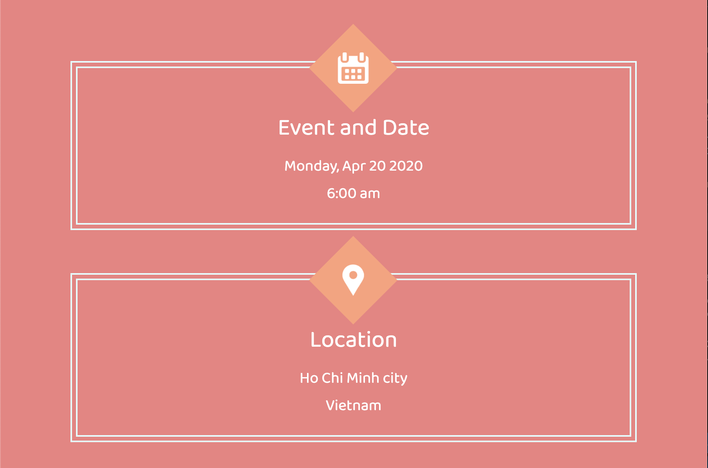

# Food Event
A static react website for a food event

## Installation
```
# Clone the project
git clone https://github.com/HoangLong256/Food-Event

# Go into the folder
cd event_page

# Install dependencies
npm install

# Run the project
npm run start
```
## Demo Images




